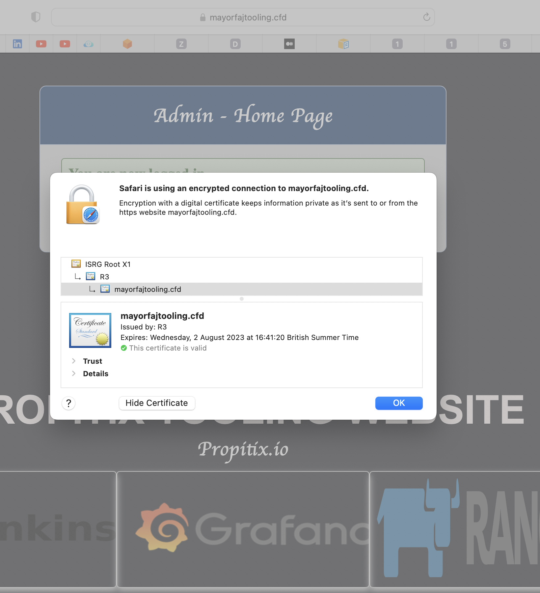
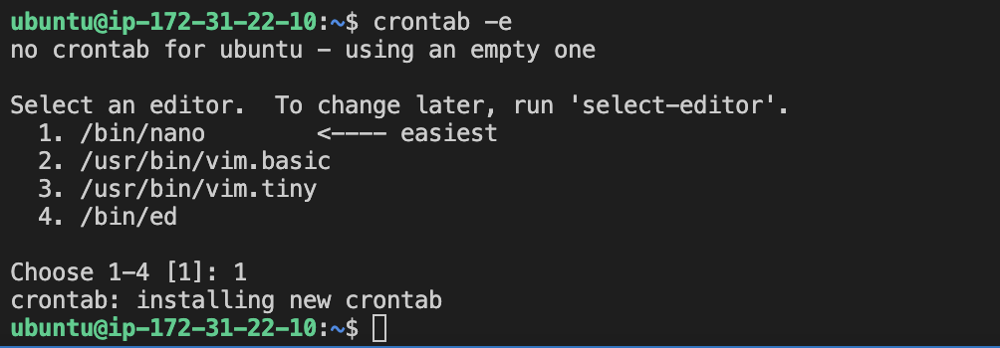

# Project-10
## **LOAD BALANCER SOLUTION WITH NGINX AND SSL/TLS**

- It is extremely important to ensure that connections to your Web solutions are secure and information is encrypted in transit.

When data is moving between a client (browser) and a Web Server over the Internet – it passes through multiple network devices and, if the data is not encrypted, it can be relatively easy intercepted by someone who has access to the intermediate equipment. This kind of information security threat is called Man-In-The-Middle (MIMT) attack.

This threat is real – users that share sensitive information (bank details, social media access credentials, etc.) via non-secured channels, risk their data to be compromised and used by cybercriminals.

SSL/TSL – is a security technology that protects connection from MITM attacks by creating an encrypted session between browser and Web server. SSL/TLS uses digital certificates to identify and validate a Website. A browser reads the certificate issued by a Certificate Authority (CA) to make sure that the website is registered in the CA so it can be trusted to establish a secured connection.

- In this project we will register our website with LetsEnrcypt Certificate Authority, to automate certificate issuance you will use a shell client recommended by LetsEncrypt `cetrbot`

## **Task:**

- In this project, I

1. Configured Nginx as a Load Balancer.

2. Registered a new domain name and configured secured connection using SSL/TLS certificates.

The target architecture will look like this;


- ## **CONFIGURE NGINX AS A LOAD BALANCER**

1. Create an EC2 VM based on Ubuntu Server 20.04 LTS and name it Nginx LB. **NB**; open TCP port 80 for HTTP connections, also open TCP port 443 – this port is used for secured HTTPS connections.

2. Update /etc/hosts file for local DNS with Web Servers’ names (e.g. Web1 and Web2) and their local private IP addresses.

`sudo vi /etc/hosts`

3. Install and configure Nginx as a load balancer to point traffic to the resolvable DNS names of the webservers

- Update the instance and Install Nginx

```
sudo apt update
sudo apt install nginx
```

- Configure Nginx LB using Web Servers’ names defined in /etc/hosts

`sudo vi /etc/hosts`

- Open the default nginx configuration file as well

`sudo vi /etc/nginx/nginx.conf`

- insert following configuration into http section

```
 upstream myproject {
    server Web1 weight=5;
    server Web2 weight=5;
  }

server {
    listen 80;
    server_name www.domain.com;
    location / {
      proxy_pass http://myproject;
    }
  }
```
- comment out this line

#`include /etc/nginx/sites-enabled/*;`

- Restart Nginx and make sure the service is up and running

```
sudo systemctl restart nginx
sudo systemctl status nginx
```


## REGISTER A NEW DOMAIN NAME AND CONFIGURE SECURED CONNECTION USING SSL/TLS CERTIFICATES


- In order to get a valid SSL certificate, there is need to register a new domain name, you can do it using any Domain name registrar; a company that manages reservation of domain names

1. Register a new domain name with any registrar of your choice in any domain zone.

2. Assign an Elastic IP to your Nginx LB server and associate your domain name with this Elastic IP

- You might have noticed, that every time you restart or stop/start your EC2 instance – you get a new public IP address. When you want to associate your domain name – it is better to have a static IP address that does not change after reboot. Elastic IP is the solution for this problem, learn how to allocate an Elastic IP and associate it with an EC2 server [on this page](https://docs.aws.amazon.com/AWSEC2/latest/UserGuide/elastic-ip-addresses-eip.html)

3. Update A record in your registrar to point to Nginx LB using Elastic IP address.
Learn howto associate your domain name to your Elastic IP [on this page](https://medium.com/progress-on-ios-development/connecting-an-ec2-instance-with-a-godaddy-domain-e74ff190c233)


- Go to your EC2 instance as well, go to Services, search and click *Route 53* , go to hosted zones, and create hosted zone.
After the successful creation of hosted zone, create record, add the domain name and the Nginx server static IP address. Add the value/route traffic to the Domain Name Registrar in Manage DNS.

4. Configure Nginx to recognize your new domain name.

- Update your `nginx.conf` with `server_name www.<your-domain-name.com>` instead of `server_name www.domain.com`

5. Install certbot and request for an SSL/TLS certificate

- Make sure snapd service is active and running

`sudo systemctl status snapd`


- Install certbot

`sudo snap install --classic certbot`


- Request your certificate (follow the certbot instructions – you will need to choose which domain you want your certificate to be issued for, domain name will be looked up from nginx.conf file so make sure you have updated it on step 4)

```
sudo ln -s /snap/bin/certbot /usr/bin/certbot
sudo certbot --nginx
```


- Test secured access to your Web Solution by trying to reach `https://<your-domain-name.com>`

- You shall be able to access your website by using HTTPS protocol (that uses TCP port 443) and see a padlock pictogram in your browser’s search string.
Click on the padlock icon and you can see the details of the certificate issued for your website



6. Set up periodical renewal of your SSL/TLS certificate

- By default, LetsEncrypt certificate is valid for 90 days, so it is recommended to renew it at least every 60 days or more frequently

- You can test renewal command in dry-run mode

`sudo certbot renew --dry-run`


- Best pracice is to have a scheduled job to run renew command periodically. Let us configure a cronjob to run the command twice a day

- To do so, lets edit the crontab file with the following command:

`crontab -e`

- Add the following line:

`* */12 * * *   root /usr/bin/certbot renew > /dev/null 2>&1`



- NB: The interval of this cronjob can always be changed if twice a day is too often by adjusting schedule expression.


## The implementation of an Nginx Load Balancing Web Solution with secured HTTPS connection with periodically updated SSL/TLS certificates is successful

# **THANKS!!!**

